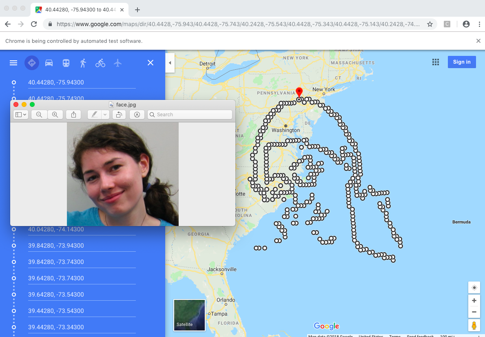
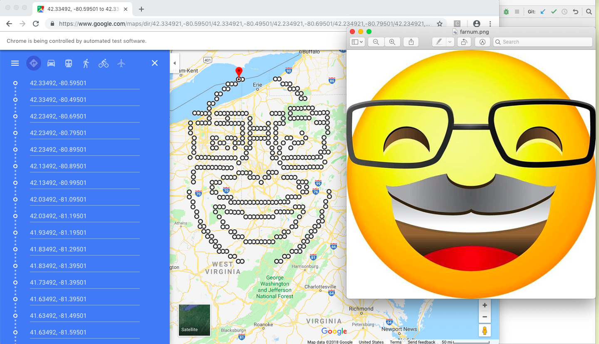
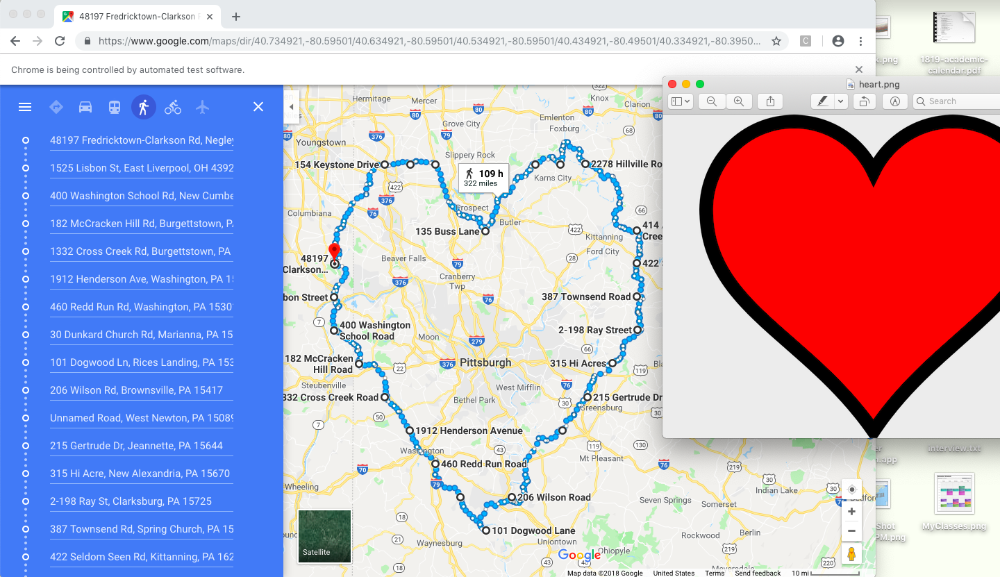

# World Art, Winner at Hack112 (Largest hackathon at CMU)

Welcome to our Hack112 Project! We made an image-to-map converter. Here is our video explaining the process.
https://youtu.be/iwYcQBEapPg

A set of python scrips converts an image to its barebones contours, and then maps its coordinates. We used Google Map APIs to create the link. Here's some examples!

# Our 15-112 professor, the venerable Kelly Rivers

# CMU's new President has his own emoji!

# A romantic getaway trip surrounding Pittsburgh:

Starting position of the route and size of the created image are all customizable through options that we did not make user-friendly to figure out. Hope you enjoy!
